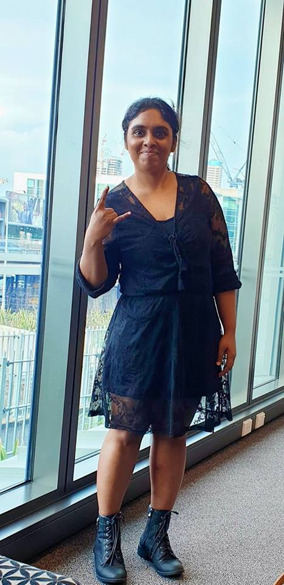

<html lang="en">
    <head>
        <meta charset="utf-8">
        <meta http-equiv="X-UA-Compatible" content="IE=edge">
        <meta name="viewport" content="width=device-width, initial-scale=1">
        <title>Arosha Perera : Home</title>
        <link rel="icon" type="image/icon" href="assets/images/tabicon.ico">
        <link rel="stylesheet" type="text/css" href="">
        <link href="assets/css/bootstrap.min.css" rel="stylesheet">
        <link href="assets/css/bootstrap-theme.min.css" rel="stylesheet">
        <link href="assets/css/font-awesome.min.css" rel="stylesheet">
        <link href="https://fonts.googleapis.com/css?family=Open+Sans:400,400i,600,700,700i" rel="stylesheet">
        <link href="https://fonts.googleapis.com/css?family=Crimson+Text:400,700,700i|Josefin+Sans:700" rel="stylesheet">
        <link href="assets/css/main.css" rel="stylesheet">
        <link rel="icon" href="assets/images/logo.png">
        <link rel="stylesheet" href="https://cdnjs.cloudflare.com/ajax/libs/animate.css/3.5.2/animate.min.css">
    </head>
    <body>
        
                                           <!-- Index starts here -->
            

                

                    

                        
                    

                    

                        

                            
                            <h4>Welcome to Tech Girl</h4>
                        

                        

                            Hi, I am Arosha Perera, Software Engineer from colombo, Sri Lanka. I am passionate about java technologies, API integration and automation testing. Loving it and Living it.
                        

                        

                            
About

                            
Work

                            
Contact

                        
      
                        

							<a href="https://www.instagram.com/janithriarosha/" target="_blank"><i class="fa fa-instagram" aria-hidden="true"></i></a>
                            <a href="https://twitter.com/janithriarosha" target="_blank"><i class="fa fa-twitter" aria-hidden="true"></i></a>
                            <a href="https://www.linkedin.com/in/janiarrow/" target="_blank"><i class="fa fa-linkedin" aria-hidden="true"></i></a>
                        

                    

                

            

        
                         
        
      
            

                

                    

                        
                    

                    

                        <a href="#index" class="btn btn-rabbit back"> <i class="fa fa-angle-left" aria-hidden="true"></i> Back to home </a>
                        

                            <h2 class="page-title" text-center>About</h2>
                            

                        

                        
Hi, I am Arosha Perera. A software developer, webservice developer and food lover currently based in Auckland, New Zealand.
                        

                        
"I have studied Bsc(Hons) in IT and Graduate Dip in IT, well experienced software engineer working with java web services and spring boot framework. Expert in API integration and highly skilled in HTML, CSS, Javascript, bootstrap and SQL. I'm a Sun Certified Java Programmer, Oracle Certified Web Component Developer and ISTQB Certified Tester."
  
                    

                

            
            
        
                                                                
        
                                  <!-- Work starts here -->
            

                

                    

                        

                            

                            

                            

                        

                    

                    

                        <a href="#index" class="btn btn-rabbit back"> <i class="fa fa-angle-left" aria-hidden="true"></i> Back to Home </a>
                        

                            <h2 class="page-title" text-center>Work</h2>
                            
w

                        

                        
This is a selection of my web design and development work. I've been involve in many different types of project.
                        

                        
First project in New Zealand was YourQS project which brings the construction workers to calculate the estimated cost of their project.

                    

                

            
    
        
           
        
                             <!-- Contact starts here -->
            

                

                    

                        
                    

                    

                        <a href="#index" class="btn btn-rabbit back"> <i class="fa fa-angle-left" aria-hidden="true"></i> Back to Home </a>
                        

                            <h2 class="page-title" text-center>Contact</h2>
                            
c

                        

                        
I'm based in Auckland, New Zealand. Drop me a message and I'll get back to you.
                        

                        <!-- form -->
                        <form class="form_edit"> 
                            

                                <input type="name" class="form-control" id="exampleInputName" placeholder="Name">
                            

                            

                            <input type="email" class="form-control" id="exampleInputEmail1" placeholder="Email">
                            

                            

                            <textarea class="form-control" rows="5" placeholder="Message"></textarea>
                            

                            <button type="submit" class="btn btn-rabbit submit">Send Message</button>
                        </form>
                    

                

            

            <footer class="text-center">
                

                    

                        

                        

                    

                

            </footer>
        
                                                              <!-- Contact ends here -->
        
        
        
    </body>
</html>
