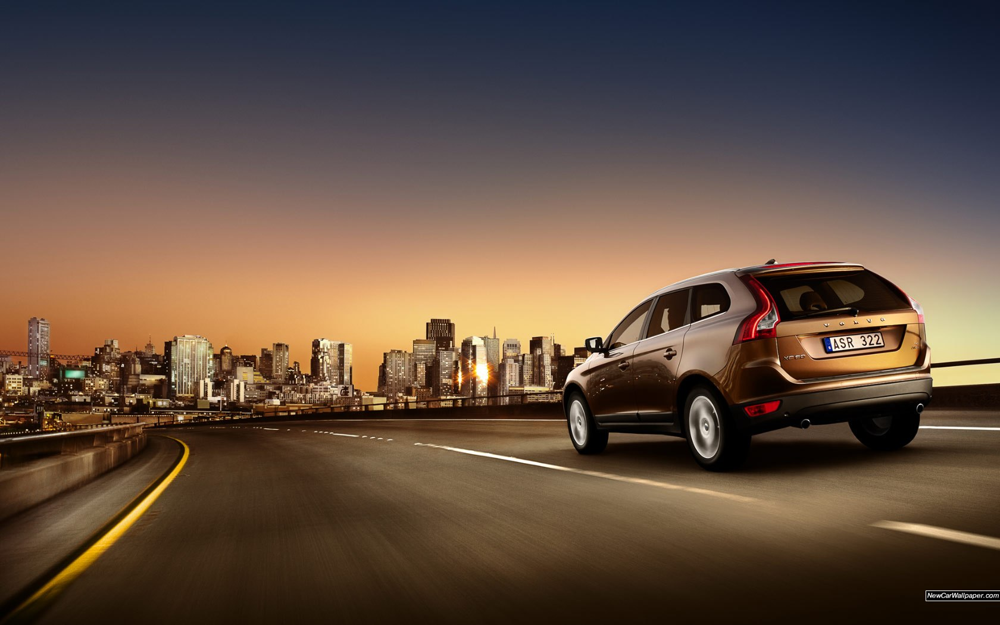

# janiarrow.github.io

<!DOCTYPE html>
<html lang="en">
   <head>
      <meta charset="utf-8">
      <meta name="viewport" content="width=device-width, initial-scale=1">
      <meta http-equiv="Content-Type" content="text/html; charset=utf-8">
      <meta http-equiv="X-UA-Compatible" content="IE=edge">
      <meta name="keywords" content="">
      <meta name="description" content="">
      <link rel="stylesheet" href="https://stackpath.bootstrapcdn.com/bootstrap/4.1.3/css/bootstrap.min.css">
      <link href="rentstylesheet.css" rel="stylesheet">
      <link rel="stylesheet" href="https://cdnjs.cloudflare.com/ajax/libs/font-awesome/4.7.0/css/font-awesome.min.css">
      <link rel="stylesheet" href="https://maxcdn.bootstrapcdn.com/bootstrap/3.3.7/css/bootstrap.min.css">
      
      
      <title>Car Rental Portal</title>
   </head>
   <body>
      <!--Header-->
      
      <!-- /Header --> 
      <!-- Banners -->
      

         <section id="banner" class="banner-section">
            

               

                  

                     <!-- Indicators -->
                     <ol class="carousel-indicators">
                        <li data-target="#myCarousel" data-slide-to="0" class="active"></li>
                        <li data-target="#myCarousel" data-slide-to="1"></li>
                        <li data-target="#myCarousel" data-slide-to="2"></li>
                     </ol>
                     <!-- Wrapper for slides -->
                     

                        

                           
                           

                              <h3>Makes it easy</h3>
                              
Pick up and drop off takes minutes just as simple. 

                           

                        

                        

                           
                           

                              <h3>Brand New</h3>
                              
Brand new cars and shuttles to and from airport!!

                           

                        

                        

                           
                           

                              <h3>HIRE WITH CONFIDENCE</h3>
                              
Trusted all over the world with friendly and professional staff

                           

                        

                     

                     <!-- Left and right controls -->
                     <a class="left carousel-control" href="#myCarousel" data-slide="prev">
                     
                     Previous
                     </a>
                     <a class="right carousel-control" href="#myCarousel" data-slide="next">
                     
                     Next
                     </a>
                  

               

               

                  <h1>Find the right car for you.</h1>
                  

                     Welcome to New Zealand’s biggest city, the City of Sails. We’re pretty stoked about our new city centre rental car location, giving our GO Rentals customers more options when they rent a car in Auckland. Our branch location is right in the heart of the city and we can arrange free pick up from the ferry terminal on the Viaduct and a number of selected CBD hotels (subject to time slots and availability), making life easier for you when you’re next in Auckland. 
                  

                  <a href="listing.php" class="btn btn-light btn-lg">See More</a>  
                  <table style="border-collapse: separate; border-spacing: 10px;">
                     <tr>
                        <td>
                           
                        </td>
                        <td>
                           
                        </td>
                     </tr>
                     <tr>
                        <td style="height:40px">
                           <a href="listing.php" class="btn btn-info btn-md">	Toyota Auris Offers Western Toyota</a>
                        </td>
                        <td  style="height:40px;font:black;">
                           <a href="listing.php" class="btn btn-info btn-md">New Car Offers from Picador Vauxhall</a>
                        </td>
                     </tr>
                  </table>
               

            

         </section>
      

      <!-- /Banners --> 
          
      <!--Footer-->
    
      <!-- Footer --> 
   </body>
</html>
